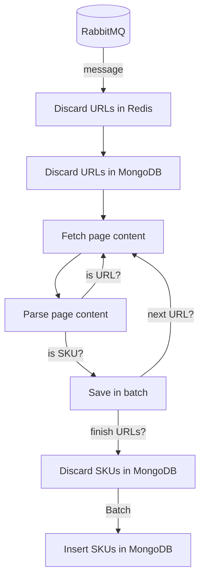

# page-scraper

# flowchart

```mermaid
flowchart TD
    rabbit[(RabbitMQ)]

    discard_urls_redis[Discard URLs in Redis]
    discard_urls_mongo[Discard URLs in MongoDB]
    fetch_page[Fetch page content]
    parse_page[Parse page content]
    save_batch[Save in batch]
    discard_skus_mongo[Discard SKUs in MongoDB]
    insert_skus[Insert SKUs in MongoDB]

    rabbit --message--> discard_urls_redis
    discard_urls_redis --> discard_urls_mongo
    discard_urls_mongo --> fetch_page
    fetch_page --> parse_page
    parse_page --is URL?--> fetch_page
    parse_page --is SKU?--> save_batch
    save_batch --next URL?--> fetch_page
    save_batch --finish URLs?--> discard_skus_mongo
    discard_skus_mongo --Batch--> insert_skus
```