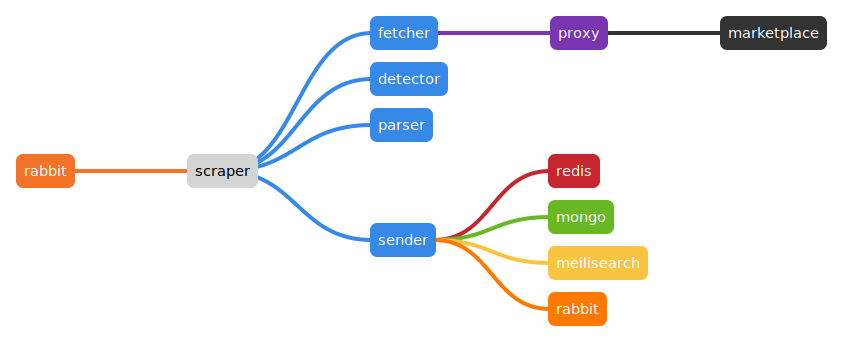
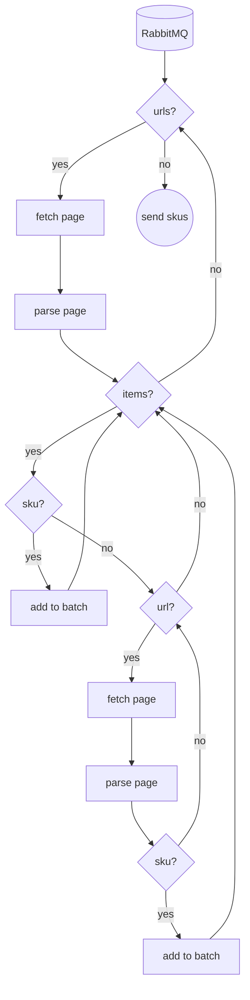

# sku-scraper
   

# flowchart

```mermaid
flowchart TD
  rabbit[(RabbitMQ)]

  fetch_page[fetch page]
  fetch_page2[fetch page]
  parse_page[parse page]
  parse_page2[parse page]
  batch[add to batch]
  batch2[add to batch]

  exist_items{items?}
  exist_urls{urls?}
  is_url{url?}
  is_sku{sku?}
  is_sku2{sku?}

  send_skus((send skus))

  rabbit --> exist_urls

  exist_urls --> |yes| fetch_page
  exist_urls --> |no| send_skus

  fetch_page --> parse_page

  parse_page --> exist_items

  exist_items --> |yes| is_sku
  exist_items --> |no| exist_urls

  is_sku --> |no| is_url
  is_sku --> |yes| batch

  batch --> exist_items

  is_url --> |yes| fetch_page2
  is_url --> |no| exist_items

  fetch_page2 --> parse_page2

  parse_page2 --> is_sku2

  is_sku2 --> |yes| batch2
  is_sku2 --> |no| is_url

  batch2 --> exist_items
```