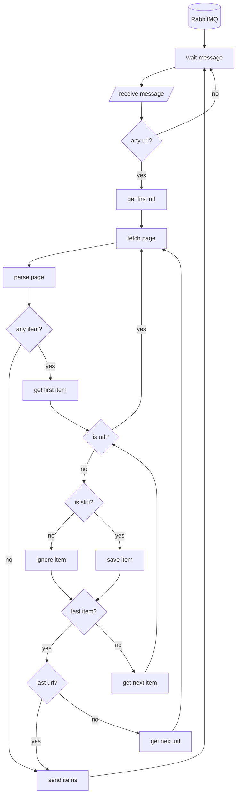

# sku-scraper

# flowchart

```mermaid
flowchart TD
    rabbit[(RabbitMQ)]

    wait_message[wait message]
    get_first_url[get first url]
    get_first_item[get first item]
    fetch_page[fetch page]
    parse_page[parse page]
    ignore_item[ignore item]
    save_item[save item]
    get_next_item[get next item]
    get_next_url[get next url]
    send_items[send items]

    receive_message[/receive message/]

    any_url{any url?}
    any_item{any item?}
    is_url{is url?}
    is_sku{is sku?}
    last_item{last item?}
    last_url{last url?}

    rabbit --> wait_message
    wait_message --> receive_message

    receive_message --> any_url

    any_url --> |yes| get_first_url
    any_url --> |no| wait_message

    get_first_url --> fetch_page
    fetch_page --> parse_page
    parse_page --> any_item

    any_item --> |no| send_items
    any_item --> |yes| get_first_item

    get_first_item --> is_url

    is_url --> |yes| fetch_page
    is_url --> |no| is_sku

    is_sku --> |no| ignore_item
    is_sku --> |yes| save_item

    ignore_item --> last_item
    save_item --> last_item

    last_item --> |yes| last_url
    last_item --> |no| get_next_item

    get_next_item --> is_url
    get_next_url --> fetch_page

    last_url ---> |yes| send_items
    last_url --> |no| get_next_url

    send_items --> wait_message
```