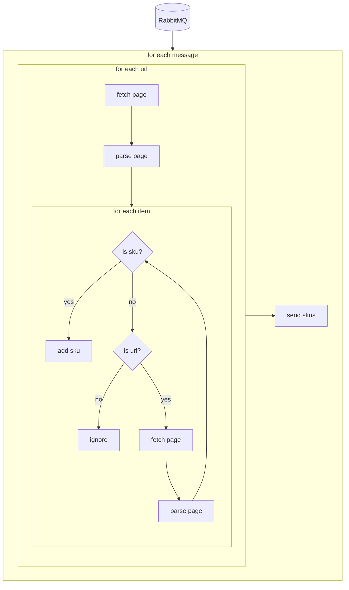

# sku-scraper

# flowchart

```mermaid
flowchart TD
    rabbit[(RabbitMQ)]

    rabbit --> for_each_message

    subgraph for_each_message[for each message]
        send_skus[send skus]
        
        subgraph for_each_url[for each url]
            direction TB
            fetch_page[fetch page]
            parse_page[parse page]

            fetch_page --> parse_page

            parse_page --> for_each_item

            subgraph for_each_item[for each item]
                direction TB

                add_sku[add sku]
                ignore[ignore]
                fetch_page2[fetch page]
                parse_page2[parse page]

                is_sku{is sku?}
                is_url{is url?}

                is_sku --> |yes| add_sku
                is_sku --> |no| is_url

                is_url --> |no| ignore
                is_url --> |yes| fetch_page2

                fetch_page2 --> parse_page2

                parse_page2 --> is_sku
            end
        end

        for_each_url --> send_skus
    end
```